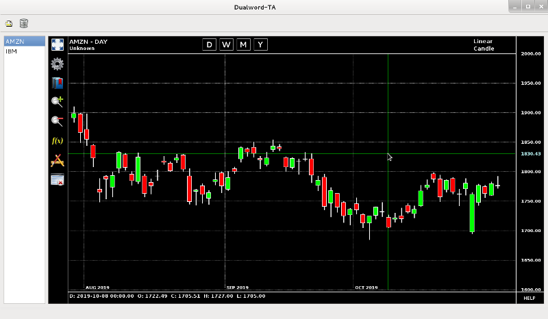

# dualword-ta

Technical analysis.

License: GNU General Public License (Version 3)  
Source code: http://github.com/dualword/dualword-ta/ 

Third Party Software:
 - Qt License: LGPL v2.1
 - SQLite License: Public domain
 - TA-Lib License: BSD
 - FreeChartGeany License: GPL

